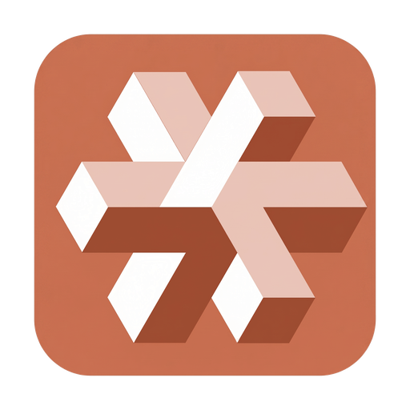

# CodeMoss

> AI statement: This project extensively uses AI generated code, not Laowu Six, and does not claim originality. I am just a stitched product

**English** · [简体中文](./README.zh-CN.md)

![][github-contributors-shield] ![][github-forks-shield] ![][github-stars-shield] ![][github-issues-shield]

**CodeMoss** =
- Multi-AI Integration: Claude Code + Codex + Gemini + OpenCode + ......
- Multi-Platform: Desktop App + JetBrains + VS Code + Mobile
- Rich Ecosystem: AI Panel + AI Memory + Superpowers + OpenSpec + Spec-kit + ...

> A picture is worth a thousand words — here are some screenshots

---

### Detailed Introduction

##### Chat Session Page

##### Sidebar Git Module

##### Sidebar File Manager Module

> Yes, you can actually edit files right here~

##### Panel Mode

> This is not an ordinary panel — it supports true parallel task execution with full interactive AI panels~

##### Sidebar Display

> Supports displaying data from multiple CLIs including Claude Code + Codex

##### Terminal Display

##### Multi-Platform Support

Supports Mac, Windows, and Linux

---
### Download & Install

There are too many features to list — feel free to explore after downloading!

Download link (fully open source, non-commercial, use with confidence): https://www.codemoss.ai/download

---

### Future Iterations

While the app is already usable, I'm not yet satisfied with the polish on the details. I plan to release at least one update per day, aiming for 100 iterations. Feedback and issues are welcome!

Your Stars and recommendations help more people discover this project. Thank you!

---

## Contributors

Thanks to all the contributors who help make CodeMoss better!

<table>
  <tr>
    <td align="center">
      
      
🔥🔥🔥

    </td>
    <td align="center">
      
      
🔥

    </td>
  </tr>
</table>

---

## Sponsorship

If this project has been helpful to you, consider sponsoring to support ongoing development!

<table>
  <tr>
    <td align="center">
      
       
      <b>Alipay</b>
    </td>
    <td align="center">
      
       
      <b>WeChat</b>
    </td>
    <td align="center">
      
       
      <b>PayPal</b>
    </td>
  </tr>
</table>

---

## Project Statement

This project initially used the MIT protocol's CodexMonitor（ https://github.com/Dimillian/CodexMonitor ）As a basic platform, I am not a big shot, and most of the code is also developed by AI

But I quite approve of this project. At the beginning, I also wanted to create my own user-friendly Vibecoding platform

I personally feel that my level is not very strong, so I would like to declare here. At the same time, I also welcome everyone to communicate with me at any time if they have any ideas and speak freely

---

## Star History

<!-- LINK GROUP -->

[github-contributors-shield]: https://img.shields.io/github/contributors/zhukunpenglinyutong/codemoss?color=c4f042&labelColor=black&style=flat-square
[github-forks-shield]: https://img.shields.io/github/forks/zhukunpenglinyutong/codemoss?color=8ae8ff&labelColor=black&style=flat-square
[github-issues-link]: https://github.com/zhukunpenglinyutong/codemoss/issues
[github-issues-shield]: https://img.shields.io/github/issues/zhukunpenglinyutong/codemoss?color=ff80eb&labelColor=black&style=flat-square
[github-license-link]: https://github.com/zhukunpenglinyutong/codemoss/blob/main/LICENSE
[github-stars-shield]: https://img.shields.io/github/stars/zhukunpenglinyutong/codemoss?color=ffcb47&labelColor=black&style=flat-square
