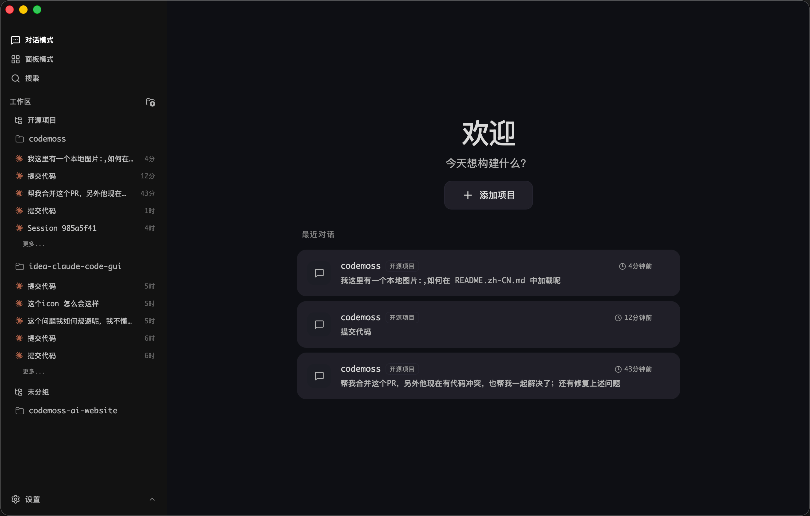

[](https://mseep.ai/app/zhukunpenglinyutong-desktop-cc-gui)

<div align="center">

# Desktop CC GUI


**English** · [简体中文](./README.zh-CN.md)

<a href="https://trendshift.io/repositories/25546" target="_blank"></a>

![][github-contributors-shield] ![][github-forks-shield] ![][github-stars-shield] ![][github-issues-shield]

</div>

**ccgui** is built for professional developers as an alternative to Cursor. Focused on developer experience, our ultimate goal is to build a 100% open-source and transparent **next-generation VibeCoding editor (powered by Claude Code, Codex, and more)**.

> This is a project built upon [CodexMonitor](https://github.com/Dimillian/CodexMonitor)



---

### Core Features

#### Multi-Engine

Manage multiple AI coding engines in a single interface and switch freely between them:

- **Claude Code** — Deep integration with the full Anthropic model family (Haiku / Sonnet / Opus)
- **Codex CLI** — Full lifecycle management with custom model and parameter support
- **OpenCode CLI** — Built-in control panel with visual configuration for Providers / MCP / Sessions
- **Gemini CLI** — Supported (under active development)
- **Custom Providers** — Configurable channels including official, regional, aggregator, and third-party services

#### Professional Development Panels

More than a chat window — a complete development workbench:

- **Chat Canvas** — Rich-text input with file/image/code snippet attachments, `@` file references, `/` command triggers
- **Built-in Terminal** — Full shell terminal powered by xterm.js with pseudo-TTY support
- **Git Panel** — Commit history visualization, branch management, worktree support, diff review
- **Kanban Board** — Drag-and-drop task management (Todo → In Progress → Testing → Done)
- **Plan Panel** — Task decomposition and planning visualization
- **Parallel Execution** — Run multiple agents simultaneously with real-time status tracking

#### AI Memory System

- **Project Memory** — Persistent memory storage with semantic classification (8+ memory types)
- **Skills System** — Reusable skill/agent management with import and export support
- **Prompt Library** — Custom prompt management and quick execution

#### MCP Protocol Support

Built-in Model Context Protocol support for configuring and managing MCP Servers, extending AI tool-calling capabilities.

#### Cross-Platform Native Experience

- **macOS** — Frameless window with native title bar integration (Intel / Apple Silicon / Universal)
- **Windows** — Frameless window with custom drag regions
- **Linux** — AppImage packaging, ready to use out of the box

#### More Capabilities

- Voice dictation (Whisper model, macOS/Linux)
- Global search (files, conversations, kanban, skills, commands, and more — 8 result types)
- Syntax highlighting (CodeMirror 6 + Prism.js, 10+ languages)
- Mermaid diagram rendering
- Multi-language UI (English / Chinese)
- Auto-update

---

### Local Development and Debugging

#### 1. Prerequisites

Make sure the following tools are installed:

- [Node.js](https://nodejs.org/) (>= 18)
- [Rust](https://rustup.rs/) (stable)
- [Tauri CLI](https://tauri.app/) (`npm install -g @tauri-apps/cli`)
- cmake

Run the environment check:

```bash
npm run doctor
```

#### 2. Install Frontend Dependencies

```bash
npm install
```

#### 3. Start Development Mode

```bash
npm run tauri:dev
```

> The first launch will compile the Rust backend, which takes longer. Subsequent launches use incremental compilation.

#### 4. Frontend-Only Development (without Tauri)

```bash
npm run dev
```

#### 5. Build for Production

```bash
# macOS (Apple Silicon)
npm run build:mac-arm64

# macOS (Universal)
npm run build:mac-universal

# Windows
npm run build:win-x64

# Linux
npm run build:linux-x64
```

#### 6. Linting and Testing

```bash
npm run lint          # ESLint check
npm run typecheck     # TypeScript type check
npm run test          # Run frontend tests
```

---

### Download

Download link: https://github.com/zhukunpenglinyutong/desktop-cc-gui/releases

---

### Future Iterations

While the app is already usable, I'm not yet satisfied with the polish on the details. I plan to release at least one update per day, aiming for 100 iterations. Feedback and issues are welcome!

Your Stars and recommendations help more people discover this project. Thank you!

---

### License

[MIT](https://github.com/zhukunpenglinyutong/desktop-cc-gui?tab=MIT-1-ov-file)

---

## Friendship Link

Thanks for the support and feedback from the friends at [LINUX DO](https://linux.do/). 

---

## Contributors

Thanks to all the contributors who help make ccgui better!

<table>
  <tr>
    <td align="center">
      <a href="https://github.com/zhukunpenglinyutong">
        
      </a>
      <div>🔥🔥🔥</div>
    </td>
    <td align="center">
      <a href="https://github.com/chenxiangning">
        
      </a>
      <div>🔥🔥🔥</div>
    </td>
    <td align="center">
      <a href="https://github.com/youcaizhang">
        
      </a>
    </td>
  </tr>
</table>

---

## Star History

[](https://www.star-history.com/#zhukunpenglinyutong/desktop-cc-gui&type=date&legend=top-left)

<!-- LINK GROUP -->

[github-contributors-shield]: https://img.shields.io/github/contributors/zhukunpenglinyutong/desktop-cc-gui?color=c4f042&labelColor=black&style=flat-square
[github-forks-shield]: https://img.shields.io/github/forks/zhukunpenglinyutong/desktop-cc-gui?color=8ae8ff&labelColor=black&style=flat-square
[github-issues-link]: https://github.com/zhukunpenglinyutong/desktop-cc-gui/issues
[github-issues-shield]: https://img.shields.io/github/issues/zhukunpenglinyutong/desktop-cc-gui?color=ff80eb&labelColor=black&style=flat-square
[github-license-link]: https://github.com/zhukunpenglinyutong/desktop-cc-gui/blob/main/LICENSE
[github-stars-shield]: https://img.shields.io/github/stars/zhukunpenglinyutong/desktop-cc-gui?color=ffcb47&labelColor=black&style=flat-square
